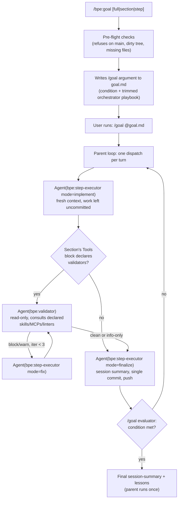

# BPE Plugin

Brainstorm-Plan-Execute development workflow with session tracking and lessons learned.

## Overview

This plugin packages the BPE loop - a structured workflow for building software with Claude Code using test-driven development. It also includes session management for tracking work history and accumulating lessons across sessions.

## Commands

| Command | Purpose |
|---|---|
| `/bpe:brainstorm` | Iterative Q&A to develop a project specification (`spec.md`) |
| `/bpe:retrofit` | Retrofit a BPE-compatible `spec.md` onto an existing project that lacks one. Reads repo state, runs a shortened Q&A on the gaps; pass `--replace` to overwrite an existing spec |
| `/bpe:plan` | Transform spec into implementation roadmap (`plan.md` + `todo.md`). Refuses when `plan.md` already exists: pass `--archive` to preserve it under `.ai-sessions/` before regenerating, or `--regen` to discard and regenerate. Dispatches `bpe:cheap-research` for external tool discovery by default; pass `--no-discover` to skip it |
| `/bpe:execute-plan` | Implement one step at a time following the plan's sub-steps: TDD Feature steps or checklist Task steps |
| `/bpe:gh-issue` | Fetch a GitHub issue and route to brainstorm or plan |
| `/bpe:commit-message` | Generate a commit message explaining what was changed |
| `/bpe:session-summary` | Generate session recap and capture lessons learned |
| `/bpe:handoff` | Compact the current conversation into an ephemeral handoff document for a fresh agent |
| `/bpe:review` | Generate an HTML view of `spec.md` / `plan.md` / `todo.md` and serve it locally for visual review with annotations |
| `/bpe:apply-review` | Load saved review feedback and apply changes to the reviewed artifact |
| `/bpe:lessons` | View, search, and manage accumulated lessons |
| `/bpe:wtf-wid` | WTF was I doing? Tight, fits-on-screen recap of the current session for fast re-entry |
| `/bpe:goal` | Wrap the BPE loop in a `/goal`-driven autonomous run. Pre-flights safety, writes the `/goal` argument to `goal.md` — run with `/goal @goal.md` |

As of 0.6.0, BPE commands are implemented as skills.
Invocation is unchanged: each `/bpe:<name>` above works exactly as before.
The underlying file layout moved from `commands/<name>.md` to `skills/<name>/SKILL.md`.

## Agents

| Agent | Model | Purpose |
|---|---|---|
| `bpe:step-executor` | sonnet | Worker for `/bpe:goal` autonomous runs. Executes one plan step per dispatch in `implement`, `fix`, or `finalize` mode. |
| `bpe:validator` | opus | Read-only QA reviewer dispatched between `implement` and `finalize`. Checks the uncommitted diff against declared skills, MCPs, and linters, returns a structured findings block. |
| `bpe:cheap-research` | haiku | Fast, cheap external research: tool discovery, docs lookup, quick fact-checks. Dispatched by `/bpe:plan`, `/bpe:brainstorm`, and `/bpe:retrofit` when they need external info. |

## The BPE Loop

1. **Brainstorm** - Develop a thorough specification through iterative dialogue
2. **Plan** - Break the spec into right-sized implementation steps: TDD Feature steps for application logic, checklist Task steps for everything else
3. **Execute** - Implement steps one at a time, following the plan exactly
4. **Review & Record** - Summarize the session and capture lessons for next time

## Session Management

Session artifacts live in `.ai-sessions/` at the project root:

- **Session summaries** - Individual markdown files capturing what happened each session
- **lessons.md** - Accumulated cross-session learnings in a hybrid format (recent + categorized)

The execute-plan skill automatically reads the most recent session summary for continuity. Format specs and workflow rules live in `references/session-management.md`, which the relevant skills read directly; it is a shared reference document, not a skill of its own.

## Autonomous Mode

Requires Claude Code v2.1.139+.

`/bpe:goal` wraps the BPE loop in Claude Code's `/goal` autonomous-execution primitive. The parent session orchestrates; each step is delegated to the `bpe:step-executor` subagent (fresh context per dispatch, no compaction risk). The parent's transcript stays small, the subagent does the work, and `/goal`'s evaluator watches the parent transcript to decide when the run is complete.



Modes:

- `full` (default) — converges only when every item in `todo.md` is checked off and tests pass. The main use case.
- `section <name>` — converges after every item in a labeled section is checked off.
- `step` — converges after one item. Rarely useful; for a single interactive step, use `/bpe:execute-plan` instead. `step` is here for the case where you want the autonomous-mode contracts (SHA verification, session-summary-per-commit, push) on one item.

Hard guarantees:

- **Refuses to run on `main`/`master`.** Create a feature branch first.
- The subagent commits with `git commit -S -F commit-msg.md`, then `git push`. If push fails, it stops cleanly with a `Failure:` report.
- Each subagent dispatch is a fresh context — no compaction, no /clear required.
- Interrupted dispatches (usage-limit pause, crash, killed subagent) never leave half-finished work behind: on the next turn the orchestrator resets the tree to the last commit (`git reset --hard && git clean -fd`) and redoes the item from `mode=implement`. The commit is the only durable unit.
- `/goal clear` is the escape hatch. Subagent reports remain in the transcript for review.

`/bpe:goal` writes the assembled `/goal` argument to `goal.md` at the repo root: the condition followed by a trimmed orchestrator playbook, together under `/goal`'s 4000-character cap. You then run `/goal @goal.md` — Claude Code's `@` expansion inlines the file contents as the `/goal` argument, so no copy-paste is needed. The condition leads (the evaluator focuses on its AND clauses); the playbook follows in the same message and tells the parent session how to drive the loop. `goal.md` is intended to be gitignored — `/bpe:goal` refuses to run if it isn't. The file MUST NOT start with `/goal ` since `@goal.md` already supplies the argument; the command writes the body only.

Three hard contracts the orchestrator enforces:

- **SEQUENTIAL DISPATCHES ONLY.** Exactly one `Agent(subagent_type="bpe:step-executor")` per turn. The Agent tool's standard guidance encourages parallel dispatches for independent work; that guidance does NOT apply here because todo.md items share state (todo.md checkmarks, git state, the test suite). Parallel dispatches corrupt all three. The orchestrator block emitted by `/bpe:goal` explicitly forbids parallel dispatches; the subagent has a defense-in-depth pre-flight that aborts on a non-empty `git status --short` (which a concurrent subagent would leave).
- **Every commit in the loop must include a new `.ai-sessions/session-*.md`.** After each subagent dispatch, the orchestrator parses the `Commit:` SHA from the report and verifies that exact commit (not `HEAD`, which is unreliable if anything raced) contains a session summary. Stops on miss.
- **Exactly one commit per dispatch.** No follow-ups, no fixups, no amends, no `--no-verify`. If a subagent discovers something needs fixing after its commit lands, that's a `Failure:` — the orchestrator does NOT make the follow-up.

Put your session into auto mode before pasting so subagent tool calls don't prompt you mid-loop. The exact mechanism depends on your client (TUI users typically toggle this with a keyboard shortcut).

## Per-user model profiles

Skills and agents ship with fixed `model:` tiers in their frontmatter.
A `.claude/bpe.local.md` settings file overrides those defaults per skill and per agent, grouped into named profiles you switch per machine, per project, or per shell.
The canonical schema and lookup precedence live in [references/model-profiles.md](references/model-profiles.md).

Quick start:

1. Copy [`.claude/bpe.local.md.example`](../.claude/bpe.local.md.example) from this repo's root to `~/.claude/bpe.local.md` (user-global) or to `.claude/bpe.local.md` in a project (per-project; shadows the user-global file key by key).
2. Set `active_profile` to the profile you want live.
3. Add per-skill or per-agent overrides under that profile. Values are family aliases (`opus`, `sonnet`, `haiku`) or pinned model IDs (`claude-opus-4-7`). Anything you leave out falls back to the frontmatter default, so list only what differs.

The `BPE_PROFILE` environment variable switches profiles per shell: `BPE_PROFILE=work claude` selects the `work` profile for that session regardless of what the files say.

When you invoke a `/bpe:` skill, the `profile-check` hook ([hooks/profile-check.md](hooks/profile-check.md)) compares the profile-resolved model against the current session model and warns on mismatch, suggesting `/model <X>` before proceeding.
It never blocks; the skill runs either way.

The real settings file is user-local state and must not be committed.
Keep `.claude/*.local.md` in your `.gitignore` (this repo's covers it).

## Installation

Install via the marketplace registered in this repo:

```
/plugin marketplace add MasonEgger/claude-code-plugin
/plugin install bpe@mmegger-plugins
```

See the [top-level README](../README.md) for the full plugin list and marketplace details.

## Reference

- [How I Actually Use the Damn Thing](https://mason.dev/blog/how-i-actually-use-the-damn-thing/) - The BPE loop explained
- [What I Found Actually Works](https://mason.dev/blog/what-i-found-actually-works-with-ai/) - Prompts as code philosophy
- [Skills, Plugins, and MCP Oh My](https://mason.dev/blog/skills-plugins-and-mcp-oh-my/) - Claude Code customization approach
